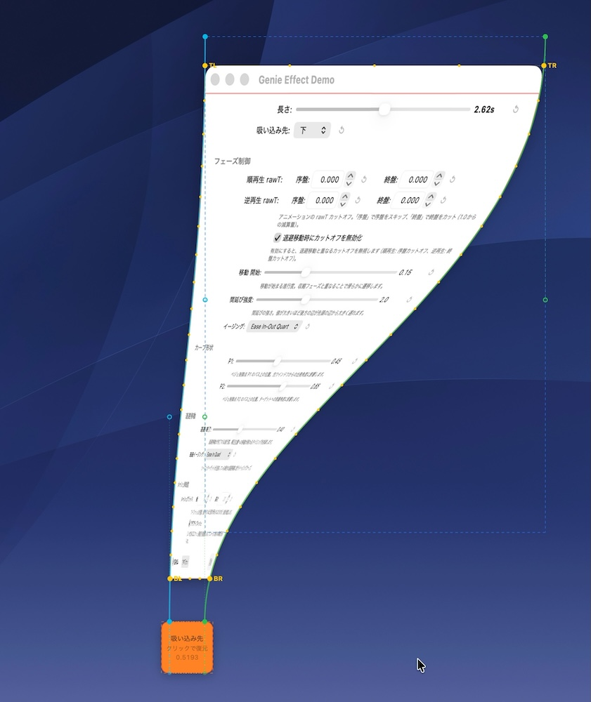

# GenieWarpMesh

macOS のジニーエフェクト風の最小化・復元アニメーションを任意の `NSWindow` に適用する Swift パッケージです。内部では非公開 API `CGSSetWindowWarp` を使用しています。

[English (英語)](README.md)



## 要件

- macOS 14.0+
    - （macOS 26.4でのみテスト済み）
- Swift 5.9+

## インストール

### Swift Package Manager

パッケージをローカル依存として追加するか、リポジトリ URL を指定してください:

```swift
dependencies: [
    .package(url: "https://github.com/usagimaru/GenieWarpMesh.git", from: "1.0.0")
]
```

ターゲットの依存に `GenieWarpMesh` を追加します:

```swift
.target(
    name: "YourApp",
    dependencies: ["GenieWarpMesh"]
)
```

アプリ側で CGS 非公開 API（`CGSGetWindowBounds` など）を直接使用する場合は、`CGSPrivate` も追加してください:

```swift
dependencies: ["GenieWarpMesh", "CGSPrivate"]
```

## 使い方

### 基本的な最小化と復元

`GenieEffect` インスタンスを作成し、`minimize(window:to:direction:completion:)` / `restore(window:from:direction:completion:)` を呼び出します。矩形パラメータはすべて **Cocoa座標系 (左下原点)** を使用するため、`NSWindow.frame` や `NSScreen.frame` の値をそのまま渡せます。

```swift
import GenieWarpMesh

let genieEffect = GenieEffect()

// Minimize: ウインドウをターゲット矩形にワープして非表示にする
genieEffect.minimize(window: myWindow, to: dockIconFrame) {
    print("ウインドウがしまわれた")
}

// Restore: ターゲット矩形から逆再生ワープで復元する
genieEffect.restore(window: myWindow, from: dockIconFrame) {
    print("ウインドウが再表示された")
    myWindow.makeKey()
}
```

`minimize` 完了後、ウインドウは orderOut (非表示) されますが**閉じられません** — ワープ状態は保持されます。次の `restore`（または別の `minimize`）呼び出し時にワープは自動的にリセットされます。

> **注意:** `GenieEffect` はウインドウが最小化状態かどうかを追跡しません。内部で保持するのはアニメーション状態 (`isAnimating` / `isReversed`) のみです。`minimize` と `restore` のどちらを呼ぶかを判断するための `isMinimized` のようなフラグは、アプリ側で管理する必要があります。

### 典型的な最小化/復元フロー

```swift
class WindowController: NSWindowController {
    private let genieEffect = GenieEffect()
    private var isMinimized = false

    func toggleGenie() {
        guard let window = self.window else { return }

        let targetRect = dockTileFrame() // Cocoa座標系のターゲット矩形

        if isMinimized {
            genieEffect.restore(window: window, from: targetRect) { [weak self] in
                self?.isMinimized = false
                window.makeKey()
            }
        }
        else {
            genieEffect.minimize(window: window, to: targetRect) { [weak self] in
                self?.isMinimized = true
            }
        }
    }
}
```

### 吸い込み方向

`GenieDirection` はウインドウがワープする辺を指定します:

| 値 | 説明 |
|---|------|
| `.auto` (デフォルト) | ソース/ターゲットの位置関係から自動判定 |
| `.bottom` | 下辺に向かってワープ |
| `.top` | 上辺に向かってワープ |
| `.left` | 左辺に向かってワープ |
| `.right` | 右辺に向かってワープ |

`.auto` はソースウインドウとターゲット矩形の中心間の水平・垂直距離を比較し、支配的な軸を選択します。`direction` パラメータを省略すると自動判定になります:

```swift
// 方向は自動判定される
genieEffect.minimize(window: myWindow, to: targetRect)
```

### パラメータ設定

`GenieEffect` のプロパティは `minimize` / `restore` の呼び出し前にカスタマイズできます:

```swift
// アニメーション
genieEffect.duration = 0.5                  // アニメーション時間 (秒)
genieEffect.easingType = .easeInOutQuart     // メインのイージングカーブ
genieEffect.retreatEasingType = .easeInQuad  // 退避移動のイージング

// カーブ形状
genieEffect.curveP1Ratio = 0.45     // ベジェ制御点P1の位置 (0–1)
genieEffect.curveP2Ratio = 0.65     // ベジェ制御点P2の位置 (0–1)

// 変形挙動
genieEffect.widthEnd = 0.4          // 幅の収縮が完了するprogress値
genieEffect.slideStart = 0.15       // 主軸方向への移動が開始するprogress値
genieEffect.stretchPower = 2.0      // 後端 (trailing辺) の間延び強度

// 退避移動 (ソースとターゲットが近接している場合の自動補正)
genieEffect.retreatEnd = 0.4              // 退避移動が完了するprogress値
genieEffect.skipCutoffOnRetreat = true    // 退避移動時にカットオフを無効化

// フェーズカットオフ (アニメーションタイムラインのトリミング)
genieEffect.minimizeRawTStart = 0.0  // 順再生: 先頭からスキップする割合
genieEffect.minimizeRawTEnd = 1.0    // 順再生: この時点で停止
genieEffect.restoreRawTStart = 0.0   // 逆再生: 先頭からスキップする割合
genieEffect.restoreRawTEnd = 1.0     // 逆再生: この時点で停止

// メッシュ解像度
genieEffect.gridWidth = 8           // メッシュグリッドの列数
genieEffect.gridHeight = 20         // メッシュグリッドの行数
genieEffect.adaptiveMesh = true     // 方向に応じて解像度を自動調整
```

### イージングの種類

`EasingType` enum は標準的な多項式イージング関数を提供します:

```
linear
easeInQuad / easeOutQuad / easeInOutQuad       (2次)
easeInCubic / easeOutCubic / easeInOutCubic     (3次)
easeInQuart / easeOutQuart / easeInOutQuart     (4次)
easeInQuint / easeOutQuint / easeInOutQuint     (5次)
```

### 進捗コールバック

ディスプレイフレームごとにアニメーションの進捗 (0.0 → 1.0) を監視できます:

```swift
genieEffect.progressHandler = { progress in
    // プログレスインジケータの更新など
    print("進捗: \(progress)")
}

genieEffect.minimize(window: myWindow, to: targetRect) {
    genieEffect.progressHandler = nil  // 完了時にクリーンアップ
}
```

### デバッグオーバーレイ

#### 組み込みの DebugOverlayWindow

ライブラリにはベジェカーブパス、制御点、メッシュワイヤーフレーム、補正フレームを可視化するフルスクリーン透過オーバーレイ `DebugOverlayWindow` が含まれています。エフェクトのデバッグに最も簡単な方法です:

```swift
let debugOverlay = DebugOverlayWindow()
debugOverlay.orderFront(nil)

genieEffect.debugOverlayReceiver = debugOverlay
```

画面ジオメトリが変更された場合は `fitToScreen()` を、描画をリセットする場合は `clearCurves()` を呼び出します:

```swift
debugOverlay.fitToScreen()   // 画面解像度変更後
debugOverlay.clearCurves()   // すべての可視化をクリア
```

#### カスタムデバッグオーバーレイ

`GenieDebugOverlay` プロトコルを実装して独自の可視化を行うこともできます:

```swift
class MyOverlay: NSWindow, GenieDebugOverlay {
    func receiveCurveGuideData(
        leftCurve: (p0: CGPoint, p1: CGPoint, p2: CGPoint, p3: CGPoint),
        rightCurve: (p0: CGPoint, p1: CGPoint, p2: CGPoint, p3: CGPoint),
        sourceFrame: CGRect,
        targetFrame: CGRect,
        fitRect: CGRect?,
        leftExtensionEnd: CGPoint?,
        rightExtensionEnd: CGPoint?,
        correctedData: CorrectedCurveData?
    ) { /* カーブガイドを描画 */ }

    func receiveMeshEdgePoints(
        _ points: [CGPoint],
        gridWidth: Int,
        gridHeight: Int,
        screenHeight: CGFloat
    ) { /* メッシュワイヤーフレームを描画 */ }

    func clearMeshEdgePoints() { /* メッシュ表示をクリア */ }
}
```

アニメーションを実行せずにオーバーレイを更新する `updateDebugOverlayForCurrentLayout(sourceFrame:targetFrame:direction:)` も利用できます。ウインドウのドラッグ中にオーバーレイを更新する場合に便利です:

```swift
genieEffect.updateDebugOverlayForCurrentLayout(
    sourceFrame: window.frame,
    targetFrame: targetPanel.frame,
    direction: .auto
)
```

### 近接補正

ソースウインドウとターゲット矩形がワープ軸上で非常に近い (20 pt以内) 場合、ベジェカーブが短すぎて自然なエフェクトになりません。`GenieEffect` は自動的に補正フレームを計算してソースをターゲットから遠ざけ、退避移動を滑らかにアニメーションします。この補正をプレビューすることもできます:

```swift
if let corrected = genieEffect.computeCorrectedFrame(
    sourceFrame: window.frame,
    targetFrame: targetRect,
    direction: .bottom
) {
    print("ウインドウの退避先: \(corrected)")
}
// 補正が不要な場合は nil を返す
```

## 注意事項

- 本ライブラリは Apple 非公開 API `CGSSetWindowWarp` を使用しています。この API を使用するアプリは Mac App Store で承認されない可能性があります。
- `CGSPrivate` モジュールは `CGSSetWindowWarp`、`CGSGetWindowBounds` などの C 宣言を提供します。

## ライセンス

詳しくは[LICENSE](./LICENSE)を確認してください｡
